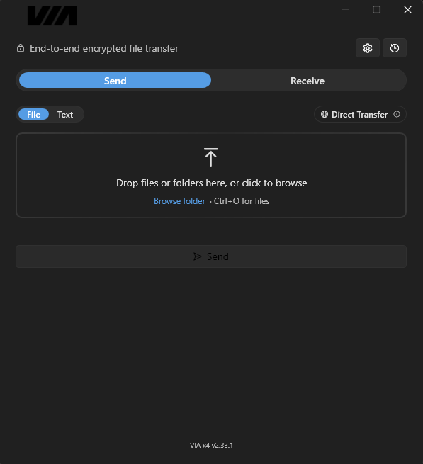
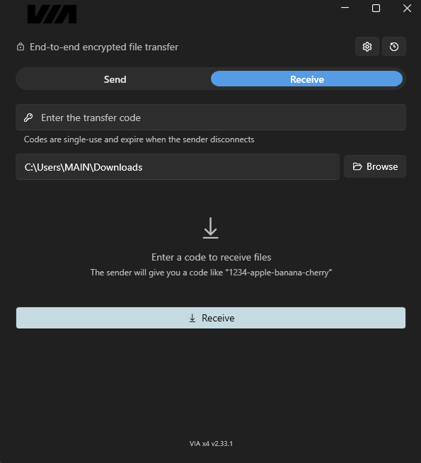

# VIA x4

**Secure, private file transfer. No accounts, no cloud, no compromise.**

VIA x4 is a Windows app that sends files directly from one device to another, fully encrypted end-to-end. There's no middleman that can read your data, no account to create, and nothing stored anywhere. The file leaves your machine and arrives on theirs — that's it.

---

## Screenshots

  
  

---

## How it works

Both the sender and receiver need VIA x4 installed. The sender drops a file, folder, or piece of text into the app and hits Send. VIA generates a short transfer code — the sender shares that code with the receiver however they like, a message, an email, anything. The receiver enters the code and hits Receive. The transfer starts immediately, fully encrypted from the moment it leaves to the moment it arrives.

The whole process takes seconds to set up and the transfer speed is only limited by your internet connection.

There is no file size limit. Whether you're sending a small document or a 100GB video archive, VIA x4 handles it the same way. No compression forced on your files, no splitting, no workarounds — it just sends. For large transfers that get interrupted by a lost connection, a restart, or anything else, VIA x4 will pick up exactly where it left off. Both sides simply reopen the app, re-enter the code, and the transfer resumes from the point it stopped — nothing has to be re-sent from the beginning.

---

## Security

Every transfer is end-to-end encrypted using PAKE (Password Authenticated Key Exchange) and ECDH (Elliptic Curve Diffie-Hellman). Before any data moves, both devices negotiate a shared secret that never leaves either machine. The relay server that helps connect them never sees anything readable — it only moves encrypted packets from one side to the other.

You can choose which elliptic curve is used for that encryption negotiation. P-256 is the same curve trusted by most of the internet including Google and Cloudflare. P-384 and P-521 step up the complexity significantly for situations where the strongest possible encryption matters. SIEC is an alternative curve for those who want something outside the standard options.

File integrity is verified after every transfer using a hashing algorithm to confirm what arrived is exactly what was sent. xxhash processes data at extremely high speed without sacrificing accuracy. imohash works at the file level rather than byte by byte, making it well suited for very large files. MD5 is the classic option, widely recognised and universally understood.

You can also set a shared passphrase — something only the sender and receiver know. Even if someone intercepted the transfer code, they still cannot receive the file without knowing the passphrase. It is an additional layer of authentication on top of everything else.

Every received file is automatically scanned by Windows Defender before it is accessible.

---

## Features

- Send files, folders, or text to anyone, anywhere
- No file size limit — send anything from a single document to multi-gigabyte archives
- Resume interrupted transfers from exactly where they stopped, nothing re-sent from the beginning
- Direct P2P mode — connects devices directly without a relay, ideal for local networks and maximum speed
- SOCKS5 and Tor support for transfers over anonymised networks
- Upload speed throttle so large transfers do not saturate your connection
- Single portable exe — no installation required, runs from anywhere, nothing left behind on your system

---

## Download

Download the latest release from the [Releases](../../releases) page.

No installation needed — just download `VIA x4.exe` and run it.

---

## License

MIT — see [LICENSE](LICENSE) for details.

Powered by [croc](https://github.com/schollz/croc) — MIT License.
